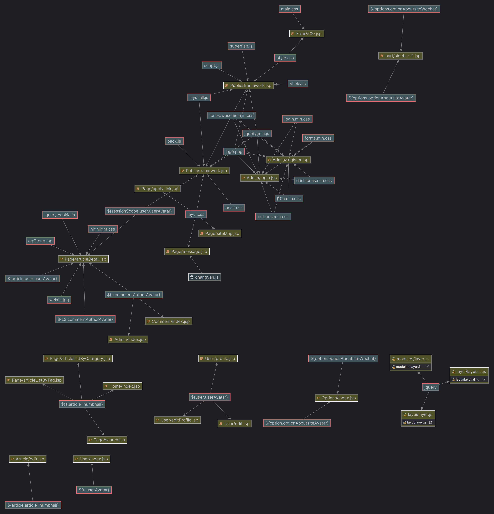
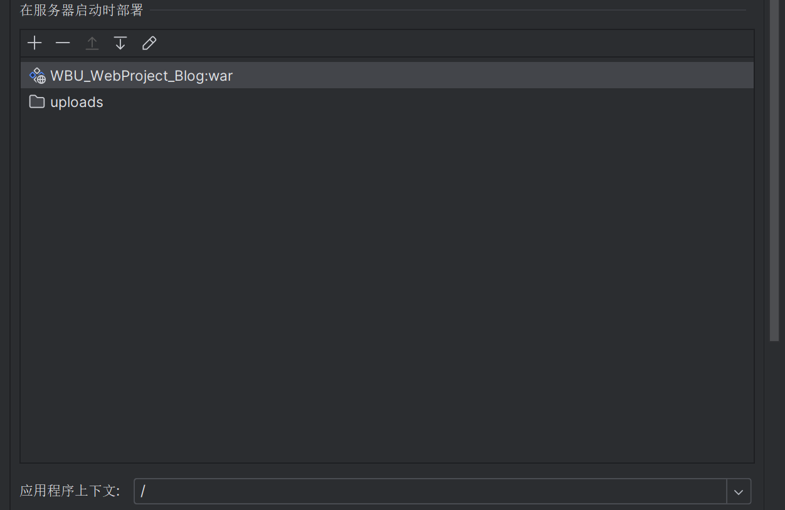

# WBU_Blog_Web_Project  
- ------------------------------------------------------------
## 一、关于项目  
 一个基于Maven、Spring、SpringMVC、MyBatis、JSP、MySQL等技术的个人博客项目，WBU_Web实训实验 
 UI用的是21年老版本的Layui组件库和手搓(copy)的css和JavaScript样式 
后台地址：/admin 或者 /login  
- -------------------------------------------------------------
## 二、项目架构  
### Dependency Diagram 
 
### Class Diagram 
 
### Client Side Dependence Diagram 
 
- -------------------------------------------------------------
## 三、使用注意  
### 1.开发工具的选择  
请使用 IntelliJ IDEA, 尽量不要用 Eclipse/MyEclipse。 

### 2.安装 Maven  
下载 Maven，并配置阿里云镜像，IDEA 或 Eclipse 里需要设置 Maven 的 settings.xml 。 

### 3.安装 Lombok 插件  
代码中多次使用 `@Data` 注解，请确保你的 IDE 安装了 `Lombok` 插件，否则找不到 getter/setter 方法。如果你的 lombok 无效，可能是 pom.xml 里的 lombok 版本和你安装的lombok 版本相差较大。 
无论是 Eclipse 还是 IDEA 都需要安装 lombok。 

## 四、使用步骤 

### 1、克隆项目   
克隆或者下载项目到本地，解压，主要分为三个部分：ForestBlog、uploads 和 forest_blog.sql  
ForestBlog: 完整项目源码, 可以使用 IDEA 导入或者打开，记得要导入里面那个 ForestBlog项目，即 pom.xml所在的父目录。   
uploads: 上传图片的目录，与源码分离开来，可以放到物理磁盘某一目录，如D盘某目录，后面会讲  
forest_blog.sql: 数据库文件，请先创建数据库，然后以运行sql文件方式导入  

### 2.使用 IDEA 导入Maven项目  
确保你安装了 Maven，导入项目时，选择已存在的项目，类型是 Maven 项目。 
等待Maven下载完依赖，或者手动点击刷新，如果无法下载请检查 Maven 配置和切换网络，多次尝试。  
导入完成后，如果出现Java类里红色报错，多半是 Lombok 插件没有安装。

### 3、 导入数据库    
新建数据库 `wbu_blog`，导入数据库（即wbu_blog.sql）。  
数据库的编码和排序规则是utf-8和utf-8_general_ci  

### 4、修改项目中的数据库连接信息    
修改 `db.properties` 文件，该文件很容易找到，在 src/main/resources 中 
里面有 MySQL, 请确保已安装和启动 MySQL  
注意修改数据库地址、表名、用户名和密码。 

 
### 5、配置 tomcat 和 uploads 目录    
该项目是 SSM 项目，没有启动类，需要通过 tomcat 来运行。 
#### 注意： 
确保 tomcat 配置中 `application context` 是 /，而不是 /WBU_WebProject_Blog。这是导致首页css样式全无的原因，因为引用css路径都是 /xxx/xxx.css 
 
该项目中，需要配置的主要是目录映射。在项目中，文件上传是传到本地，且和项目文件夹不在一起，即源码和上传目录是分离的。  
比如我们把 uploads 目录放到 D盘根目录，我们想在项目中以 `http://loclahost:8080/uploads/past_time/xxx.jpg ` 方式访问，需要以下两步： 

1、 修改 UploadFileController.java 中上传路径，需要修改 rootPath 为你指定的 uploads 目录，如 `String rootPath ="D:/uploads/";`  
如果不修改，会出现无法上传失败； 

2、为 tomcat 设置 uploads 映射。 
-  IDEA 操作如下： 
在 tomcat 配置中 Deployment 里面添加，如图
 