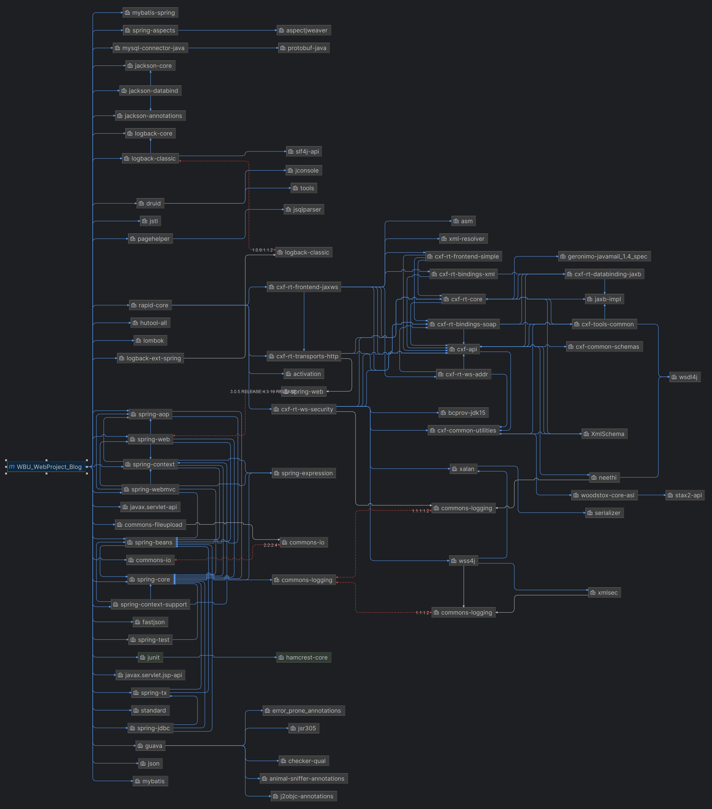

# wbuBlogWebProject
- ------------------------------------------------------------
# 关于项目
 一个基于Maven、Spring、SpringMVC、MyBatis、JSP、MySQL等技术的个人博客项目，WBU_Web实训实验 
 UI用的是21年老版本的Layui组件库和手搓(copy)的css和JavaScript样式 
后台地址：/admin 或者 /login  

## 项目架构
dependency   

